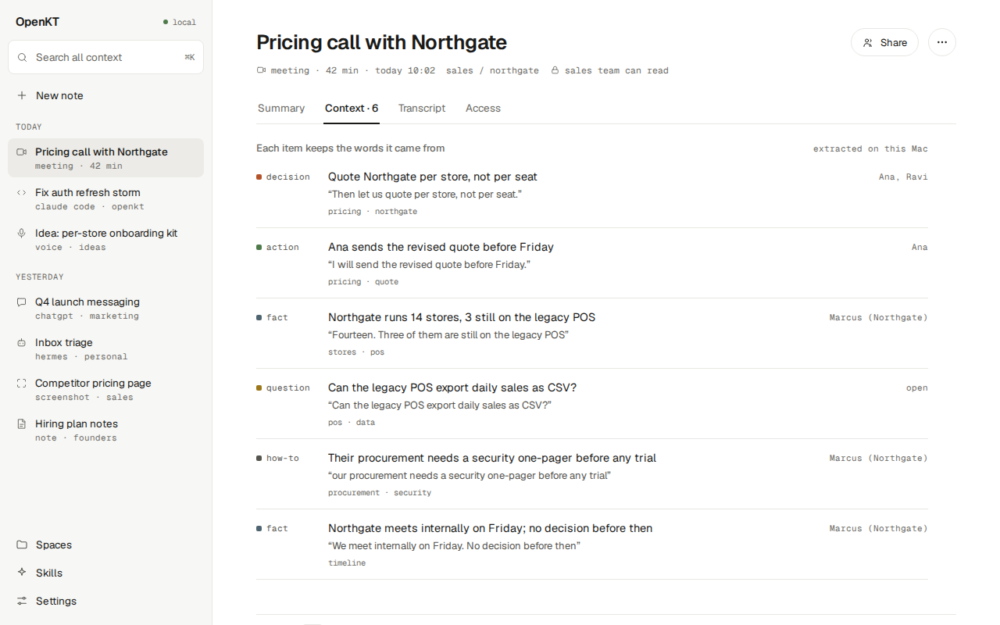
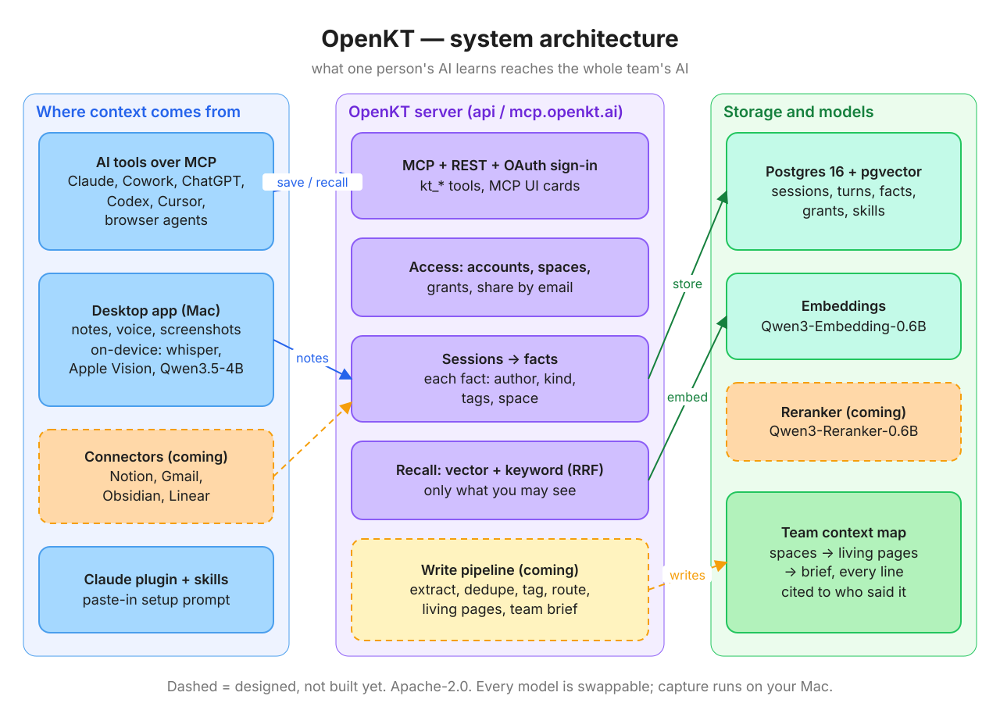
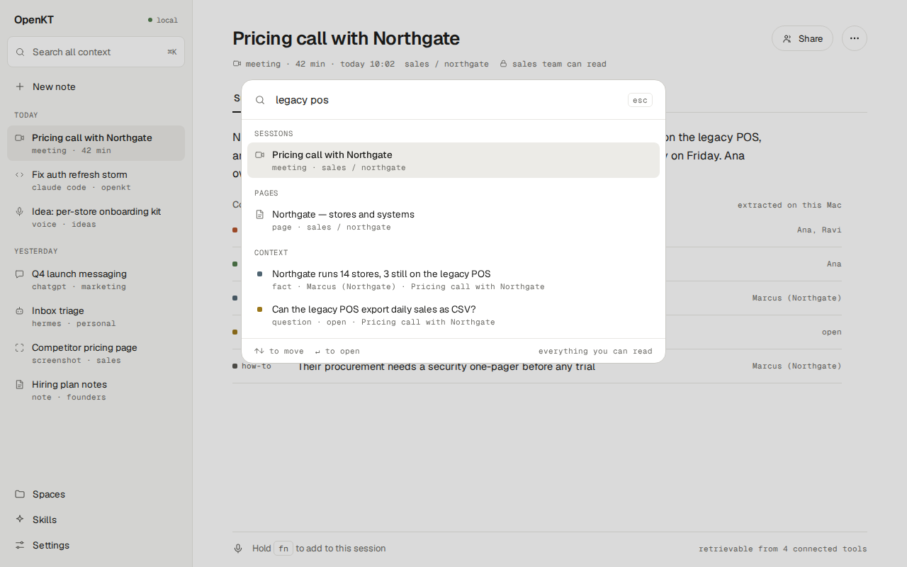
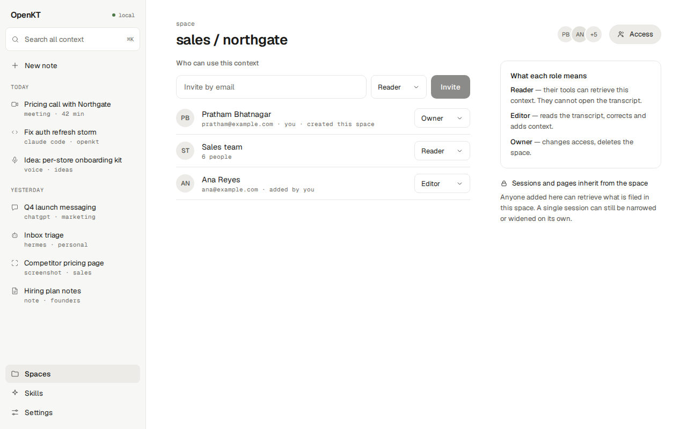
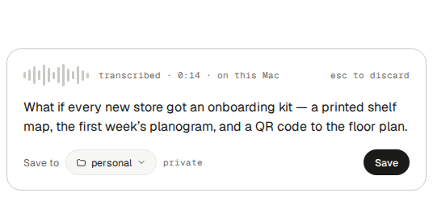
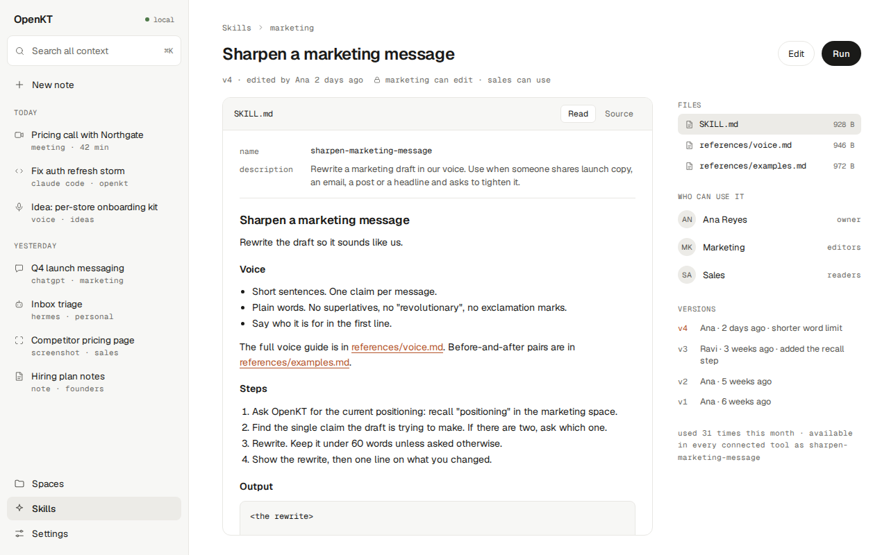

# OpenKT AI

Everyone on your team now works with several AI agents — Claude, ChatGPT, Codex, Cursor, browser agents — and every one of them starts from zero. The decision from Tuesday's meeting, the customer's real constraint, the approach you already tried and dropped: you explain it again next session, and your teammate explains it again to their agent. OpenKT is an open-source shared context layer that ends that. It captures what matters from AI sessions, notes, voice and meetings, distils it into a team knowledge base that maintains itself, and hands the right pieces back to any agent over MCP — one URL, no glue code. Role-based access control is enforced inside the retrieval query rather than bolted on after it, so an agent can only ever surface what its user is cleared to see, and every fact carries the name of the person it came from. That's what makes shared AI memory something a team can safely switch on, not just one person.



## The problem

- **Every agent starts from zero.** Each new session in each tool needs the same background explained again.
- **What one person teaches their AI stays with that person.** Your teammate's agent never hears it, so the whole team repeats the same explanations.
- **Shared memory is only safe with real access control.** An agent must never surface what its user may not see, and every claim must be traceable to the person who made it.

## How it works



1. **Capture.** Conversations with your AI tools arrive over MCP. Notes, voice notes and screenshots come from the Mac app.
2. **Facts, with who said them.** Each session is distilled into short facts. Every fact keeps the exact words it came from and the name of the person who said them.
3. **Shared with the right people.** Facts live in spaces. You decide who can read each space or session: specific teammates, or only you.
4. **Recalled by any agent.** Any MCP client asks OpenKT for context and gets back only what its user is allowed to see, with the source attached.

## What you can do

**Connect any AI tool over MCP.** Claude, Cowork, Claude Code, Codex, ChatGPT and Cursor all connect to the same URL, `https://mcp.openkt.ai/mcp`. Twelve tools let an agent start a session, recall, save, forget, list spaces, read a brief, and use shared skills.

**Save and recall across teammates, with attribution.** Whatever one person saves, a teammate's agent can recall when they have access to it. Every result names its author and the session it came from. In the app, ⌘K searches everything you can read.



**Spaces and share by email.** File context into spaces for a project, a customer or a team. Give people the reader, editor or owner role by email, and sessions inherit access from their space.



**Notes, voice notes and screenshots, captured on your Mac.** Press a hotkey and speak, or drag over part of the screen. Transcription, text recognition and image description all run on the Mac. Audio is deleted once it has been transcribed, and only the text is saved.



**Shared skills.** Write down the way your team does something once, as a skill with versioned files. Share it like any other context, and every connected tool can use it.



**Access control inside retrieval.** Permissions are applied inside the search query itself, not by filtering results afterwards. A personal space never leaks to another user.

## Open-source models

| Model | What it does | Runs on | Licence |
|---|---|---|---|
| [Qwen3.5-4B](https://huggingface.co/Qwen/Qwen3.5-4B) ([Qwen3.5-2B](https://huggingface.co/Qwen/Qwen3.5-2B) on 8 GB Macs) | Reads and writes text and images: extracts facts, summarises, describes screenshots | The Mac, via llama.cpp (4-bit GGUF) | Apache-2.0 |
| [Qwen3-Embedding-0.6B](https://huggingface.co/Qwen/Qwen3-Embedding-0.6B) | Turns facts and questions into 1024-dimension vectors for search | The server, via llama.cpp | Apache-2.0 |
| [Qwen3-Reranker-0.6B](https://huggingface.co/Qwen/Qwen3-Reranker-0.6B) | Re-orders the best search results (on the roadmap) | The server | Apache-2.0 |
| [Whisper large-v3-turbo](https://huggingface.co/openai/whisper-large-v3-turbo) ([whisper.cpp weights](https://huggingface.co/ggerganov/whisper.cpp); `small` on 8 GB Macs) | Transcribes voice notes, in many languages | The Mac, via whisper.cpp | MIT |

Text in screenshots is read by Apple Vision, a macOS system framework rather than an open-source model. Every model sits behind a URL, so each one can be swapped for your own.

## The techniques

- **Hybrid recall.** Each question runs two searches in Postgres: vector similarity with pgvector, and keyword search. The two ranked lists are merged with reciprocal-rank fusion.
- **Filter before rank, in SQL.** The recall query first restricts candidates to the spaces and sessions the caller holds a grant for. Only then does it rank them. Nothing outside the caller's access is ever scored, so nothing outside it can be returned.
- **Quote-checked fact extraction.** Every extracted fact must include a verbatim quote that is found in its source session, or it is dropped. This is a cheap, mechanical guard against a small model making things up.
- **Single-purpose small agents.** The write path is split into eight agents: extract, summarise, tag, dedupe, route, write a section, brief, and describe an image. Each one has one prompt, one narrow input and a JSON Schema its output must match, and each is tested against recorded fixtures.
- **Capture stays on the device.** Speech-to-text, text recognition and image description run on the Mac with open models. The server receives text, not audio or images.

## Get started in 2 minutes

**1. Install the Mac app** (Apple silicon, macOS 13.3 or later)

1. Download [**OpenKT for Mac**](https://openkt-downloads-724772068721.s3.ap-south-1.amazonaws.com/desktop/OpenKT-latest-arm64.dmg).
2. Open the DMG and drag **OpenKT** into **Applications**.
3. This preview build is not signed yet, so run this once in Terminal:

   ```
   xattr -dr com.apple.quarantine /Applications/OpenKT.app
   ```

4. Open OpenKT and create an account. On first launch the app downloads its local models (3–5 GB).

**2. Connect your AI tools** to `https://mcp.openkt.ai/mcp`

- **Claude and Cowork:** Settings → Connectors → Add custom connector. Paste the URL and sign in.
- **Claude Code:**

  ```
  claude mcp add --transport http openkt https://mcp.openkt.ai/mcp
  ```

  Then run `/mcp` to sign in. To also add the OpenKT skill and commands, install the plugin instead: `/plugin marketplace add masti-ai/OpenKT-ai`, then `/plugin install openkt@openkt`.
- **Codex:** add this to `~/.codex/config.toml`:

  ```toml
  [mcp_servers.openkt]
  url = "https://mcp.openkt.ai/mcp"
  http_headers = { "Authorization" = "Bearer <your token>" }
  ```

  To get your token, sign in once from the terminal:

  ```
  curl -s https://api.openkt.ai/v1/auth/login -H 'content-type: application/json' \
    -d '{"email":"you@example.com","password":"your password","client":"cli"}' | jq -r .data.token
  ```

- **Cursor:** add `{ "mcpServers": { "openkt": { "url": "https://mcp.openkt.ai/mcp" } } }` to `~/.cursor/mcp.json`, then enable **openkt** in Cursor's MCP settings and sign in.
- **ChatGPT:** turn on Settings → Security and login → Developer mode. Then create a connector at chatgpt.com/plugins with the URL and OAuth.

**3. Or let your AI do it.** Paste [this setup prompt](plugin/SETUP-PROMPT.md) into any AI tool. It works out which tool it is running in, connects OpenKT, walks you through sign-in, and checks that saving and recalling both work. It asks before it changes anything.

## Roadmap

- **Meetings:** calls become shared sessions, recorded on your Mac with no bot joining the call.
- **Team pages that maintain themselves:** facts are merged into one living page per topic, with every sentence cited, plus a short brief for each space that an agent reads first.
- **Connectors:** context from Notion, Gmail, Obsidian and Linear arrives by itself.
- **One-command self-hosting:** the whole stack with `docker compose up`.

## Self-host, contribute, licence

OpenKT is one server and one Postgres database, and there are no hosted-only features. The server is built with NestJS and Postgres 16 with pgvector, and the Mac app with Electron and React. To run your own, follow the [server README](server/README.md), then choose "Using your own server?" on the app's sign-in screen.

Contributions from people and AI agents are welcome: start with [CONTRIBUTING.md](CONTRIBUTING.md). OpenKT is licensed under [Apache-2.0](LICENSE).
