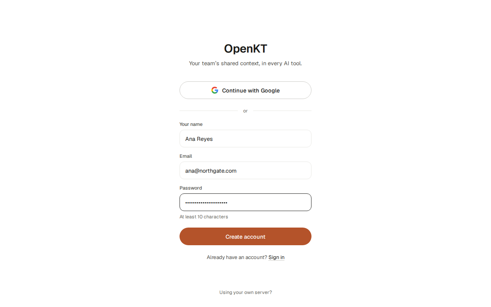

# OpenKT AI

Everyone on your team now works with several AI agents — Claude, ChatGPT, Codex, Cursor, browser agents — and every one of them starts from zero. The decision from Tuesday's meeting, the customer's real constraint, the approach you already tried and dropped: you explain it again next session, and your teammate explains it again to their agent. OpenKT is an open-source shared context layer that ends that. It captures what matters from AI sessions, notes, voice and meetings, distils it into a team knowledge base that maintains itself, and hands the right pieces back to any agent over MCP — one URL, no glue code. Role-based access control is enforced inside the retrieval query rather than bolted on after it, so an agent can only ever surface what its user is cleared to see, and every fact carries the name of the person it came from. That's what makes shared AI memory something a team can safely switch on, not just one person.

**[Install the Mac app](#install-in-2-minutes) · [Connect your AI tools](#connect-your-ai-tools) · [Use it with your team](#use-it-with-your-team)** · Apache-2.0

## The problem

- **Every agent starts from zero.** Each new session, in each tool, needs the same background again: how the team deploys, what the customer asked for, what was decided on Tuesday.
- **Context stays with one person.** What you taught your agent never reaches your teammate's agent, so the same explanation is repeated once per person, per tool.
- **Shared memory is unsafe without access control.** Pooling a team's context is only acceptable if an agent can never surface what its user may not see, and every claim can be traced to the person who made it.

## Architecture


- **Session → facts.** Every AI session, note, voice note or screenshot is kept as a session. Facts are extracted from it, and each fact must quote its source word for word or it is dropped.
- **Facts → living pages → brief.** Facts are merged into one living page per topic in a space, and every sentence on a page cites its facts. Each space also has a short brief, the first thing an agent receives when a session starts.
- **Grant-filtered hybrid recall.** A question runs vector search and keyword search together and fuses the results with reciprocal-rank fusion. It only ever ranks what the asker holds a grant for.
- **One server, one Postgres.** Every model sits behind a URL and can be swapped, and capture and speech run on your Mac. Details: [`docs/architecture.md`](docs/architecture.md) and [`docs/specs/`](docs/specs/).

## The app

The Mac app is where your team's context lives:

- **Sessions:** every AI session, note, voice note and screenshot, with its summary, the context extracted from it, the transcript, and who can see it.
- **Spaces:** shared areas for a team or a topic.
- **Capture:** quick notes, voice notes (hold a hotkey and speak) and screenshots.
- **Access:** per-session and per-space roles, and sharing by email.
- **Skills and settings:** your team's reusable skills, plus connectors, models, hotkeys, permissions and account.

The screenshots below come from the app's renderer and show sample data.

| | |
|---|---|
|  |  |
| Create an account with email and password, or connect to your own server. | A session and its context. Each item keeps the words it came from and the person who said them. |
|  |  |
| ⌘K searches everything you can read: sessions, pages and single facts. | Share a space by email. Roles are reader, editor and owner, and sessions inherit from their space. |
|  | |
| A voice note, transcribed on your Mac. The audio is deleted once it is transcribed. | |

## Features

| Feature | Status |
|---|---|
| MCP server with 12 `kt_*` tools: sessions, recall, save, forget, spaces, brief and skills | Live |
| Hybrid recall: vector and keyword search with reciprocal-rank fusion, filtered by grants | Live |
| Spaces, grants (reader, editor, owner) and sharing by email | Live |
| Built-in accounts (email and password) | Live |
| Shared skills with versioned files | Live |
| Mac app: notes, voice notes (whisper.cpp) and screenshots (Apple Vision OCR and Qwen3.5-4B vision), all on-device | Live (unsigned preview) |
| OAuth sign-in for the Claude, Cowork and ChatGPT connectors | In this release |
| MCP UI cards for saves, search results and session summaries | In this release |
| One-tick connect for Claude Code and Codex, with hooks and native-memory sync | In this release |
| Team join links | In this release |
| In-app updates for the Mac app | In this release |
| **The self-maintaining knowledge base** (living pages and the space brief), written by 8 single-purpose agents. The agents' code is in [`packages/agents`](packages/agents/) but is not yet wired to the server. | Roadmap |
| **Meeting capture** without a bot | Roadmap |
| Connectors for Notion, Gmail, Obsidian and Linear | Roadmap |
| The Qwen3 reranker in recall | Roadmap |
| `docker compose up` for self-hosting ([#15](../../issues/15)) | Roadmap |

"In this release" means merged or shipping this week but not yet live everywhere. "Roadmap" means designed but not built.

## Open-source models

| Model | Job | Where it runs | Licence |
|---|---|---|---|
| [Qwen3.5-4B](https://huggingface.co/Qwen/Qwen3.5-4B) (4-bit GGUF; [Qwen3.5-2B](https://huggingface.co/Qwen/Qwen3.5-2B) on 8 GB Macs) | Text and vision: extraction, summaries, describing screenshots | On the Mac, llama.cpp | Apache-2.0 |
| [Qwen3-Embedding-0.6B](https://huggingface.co/Qwen/Qwen3-Embedding-0.6B) | 1024-dimension embeddings for recall | On the server, llama.cpp | Apache-2.0 |
| [Qwen3-Reranker-0.6B](https://huggingface.co/Qwen/Qwen3-Reranker-0.6B) | Reranking recall results (planned) | On the server | Apache-2.0 |
| [whisper large-v3-turbo](https://huggingface.co/openai/whisper-large-v3-turbo) ([whisper.cpp build](https://huggingface.co/ggerganov/whisper.cpp); `small` on 8 GB Macs) | Voice notes to text | On the Mac, whisper.cpp | MIT |

Screenshot text is read by Apple Vision, a macOS system framework rather than an open-source model. Every model is swappable by URL, so you can point any job at your own endpoint.

## Install in 2 minutes

1. Download [**OpenKT for Mac**](https://openkt-downloads-724772068721.s3.ap-south-1.amazonaws.com/desktop/OpenKT-latest-arm64.dmg). It needs Apple silicon and macOS 13.3 or later.
2. Open the DMG and drag **OpenKT** into **Applications**.
3. This preview is not signed yet, so macOS blocks it the first time you open it. Run this once in Terminal:

   ```
   xattr -dr com.apple.quarantine /Applications/OpenKT.app
   ```

   To allow it through System Settings instead, see [`apps/desktop/INSTALL-UNSIGNED.md`](apps/desktop/INSTALL-UNSIGNED.md).
4. Open OpenKT and create an account. On first launch it downloads its local models (about 3–5 GB).

## Connect your AI tools

Every tool connects to the same MCP URL:

```
https://mcp.openkt.ai/mcp
```

- **Claude and Cowork:** Settings → Connectors → Add custom connector. Enter the URL, then sign in.
- **Claude Code:**

  ```
  claude mcp add --transport http openkt https://mcp.openkt.ai/mcp
  ```

  Then run `/mcp` to sign in. The plugin also adds the skill and the `/openkt:kt-*` commands: `/plugin marketplace add masti-ai/OpenKT-ai`, then `/plugin install openkt@openkt`.
- **Codex:** add this to `~/.codex/config.toml` (checked with codex-cli 0.131):

  ```toml
  [mcp_servers.openkt]
  url = "https://mcp.openkt.ai/mcp"
  http_headers = { "Authorization" = "Bearer <your token>" }
  ```

  Get a token by signing in from the terminal:

  ```
  curl -s https://api.openkt.ai/v1/auth/login -H 'content-type: application/json' \
    -d '{"email":"you@example.com","password":"…","client":"cli"}' | jq -r .data.token
  ```

  Or copy one from the connect page, [api.openkt.ai/connect](https://api.openkt.ai/connect), which is rolling out now.
- **ChatGPT:** turn on Settings → Security and login → Developer mode. Then add a connector at chatgpt.com/plugins, with the URL and OAuth.
- **Cursor:** add `{ "mcpServers": { "openkt": { "url": "https://mcp.openkt.ai/mcp" } } }` to `~/.cursor/mcp.json`, enable **openkt** in Cursor's MCP settings and sign in.

[`plugin/README.md`](plugin/README.md) has the exact steps for more clients.

**Or paste one prompt.** Copy [`plugin/SETUP-PROMPT.md`](plugin/SETUP-PROMPT.md) into any AI tool. It works out which tool it is in, connects OpenKT, walks you through sign-in and checks that a save and a recall both work. It asks before it changes any file.

## Use it with your team

1. Create a team in the app and copy its join link.
2. Send the link to your teammates. They open it and sign in.
3. From then on, everything saved to the team reaches every member's AI, and every fact carries the name of the person it came from.

Join links are rolling out in this release. Until then, share a space or a session by email from its **Access** tab.

## Access control, precisely

- **Filter before rank.** The recall query first restricts its candidates to the spaces and sessions the caller holds a grant for, and only then ranks them. A fact the caller may not see is never ranked, so it can never be returned.
- **Personal stays personal.** Facts in a personal space never cross to another user.
- **Every fact has an author.** Each result carries who said it and the session it came from.
- **One role model.** A grant gives a person reader, editor or owner on a workspace, a space, a single session or a skill. Facts and pages inherit from their session or space.

## Self-host and tech stack

- **Server:** NestJS, Drizzle, Postgres 16 with pgvector, serving REST, MCP and OAuth. Node 20 or later.
- **Mac app:** Electron and React, with llama.cpp, whisper.cpp and an Apple Vision OCR helper bundled.
- **Licence:** Apache-2.0, with no hosted-only features.

`docker compose up` is coming ([#15](../../issues/15)). Until then, [`server/README.md`](server/README.md) runs the server in a few commands. Then point your tools at `https://<your-host>/mcp` and choose "Using your own server?" on the app's sign-in screen. The hosted deployment is described in [`docs/DEPLOY.md`](docs/DEPLOY.md).

## Repository map

| Path | What |
|---|---|
| [`apps/desktop/`](apps/desktop/) | The Mac app |
| [`server/`](server/) | API, MCP endpoint and OAuth (a standalone npm project) |
| [`packages/agents/`](packages/agents/) | The 8 single-purpose LLM agents of the write path: prompts, JSON Schemas, fixtures |
| [`packages/recall/`](packages/recall/), [`packages/pipeline/`](packages/pipeline/) | Pure functions for ranking and write-path decisions |
| [`packages/mcp-cards/`](packages/mcp-cards/) | MCP Apps UI cards |
| [`plugin/`](plugin/) | Claude plugin, portable skill, per-tool guides, setup prompt |
| [`docs/`](docs/) | Product, architecture, [specs](docs/specs/), research, plan ([index](docs/README.md)) |
| [`design/`](design/) | The design canvas the app is built from |

## Contributing

Contributions from people and AI agents are welcome. The work is cut into small, fully specified tasks. Start with [`CONTRIBUTING.md`](CONTRIBUTING.md), which has the developer quick start, and [`AGENTS.md`](AGENTS.md). Everyone follows the [code of conduct](CODE_OF_CONDUCT.md). Report security problems privately, as described in [`SECURITY.md`](SECURITY.md).

## Licence

Apache-2.0. See [`LICENSE`](LICENSE) and [`NOTICE`](NOTICE).
