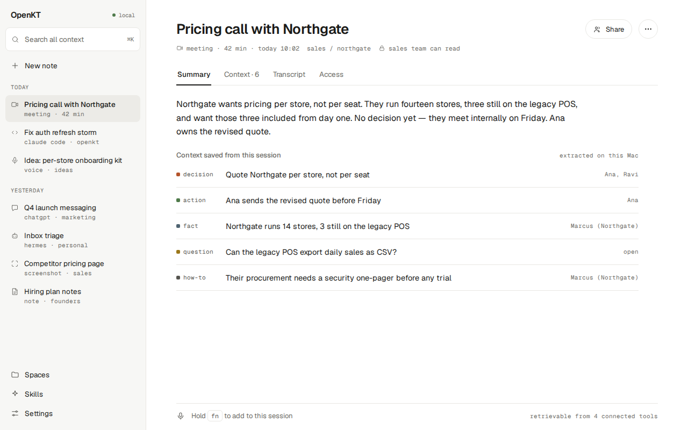

# OpenKT

OpenKT is an open-source shared context engine for teams: it captures sessions from any AI tool, distils them into a team knowledge base, and hands the right context back to any teammate's tool over MCP — within the access its owner allowed.

## Why

People spend a real part of their day explaining things to AI tools: how the team deploys, what the customer asked for, which approach was already tried and dropped. That explanation is thrown away three times over — between sessions, between tools, and between people. Wikis do not fix it because nobody writes them; personal memory features do not fix it because they stop at one person and one vendor.

OpenKT keeps that context in one place a team controls. One server and one Postgres database, any OpenAI-compatible model endpoint, access that works like a code host (grants on workspaces, spaces and single sessions), and retrieval that only ever returns what the asking person holds a grant for. Self-hostable, Apache-2.0, no hosted-only features.

The full picture is in [`docs/product.md`](docs/product.md).

## Status

OpenKT is pre-release. Nothing has been published or versioned yet, and there is no hosted service. This table is the honest state of the repository today.

| | What | State |
|---|---|---|
| Works now | **Server** (`server/`): sessions, grants, access-scoped hybrid recall (keyword and vector), MCP tools (`kt_session_start`, `kt_recall`, `kt_save_memory`, `kt_session_end` and others) | Runs against Postgres with pgvector. An end-to-end proof test shows context saved by one person reaching a teammate and staying invisible to a stranger. The imported codebase is still being cleaned up. |
| In progress | **Agents** (`packages/agents`): the eight single-purpose LLM agents of the write path, with prompts, JSON Schemas, fixtures and an evaluation script | Unit-tested against scripted model replies. Not yet run against a real model. |
| In progress | **Desktop app** (`apps/desktop`): Electron shell with every screen from the design canvas | Renders and navigates on mock data. The capture engine is a stub; the HTTP adapter has not been run against a live server. |
| In progress | **Plugin, skill and setup prompt** (`plugin/`), **MCP Apps cards** (`packages/mcp-cards`) | Built and validated locally (`claude plugin validate`, unit tests, a fake host). Not yet tested inside claude.ai or ChatGPT. |
| In progress | **Recall and pipeline functions** (`packages/recall`, `packages/pipeline`) | Package skeletons with types and errors. The functions are open contributor tasks. |
| Planned | Living pages and briefs, built-in sign-in, `docker compose up`, local voice and screenshot capture, meetings without a bot, connectors to other products | Specified in [`docs/specs/`](docs/specs/), scheduled in [`PLAN.md`](PLAN.md). Not built. |



*The desktop app showing a session, on mock data.*

## Repository map

| Path | What |
|---|---|
| [`server/`](server/) | The API and worker: NestJS, Drizzle, Postgres with pgvector, the MCP endpoint. Has its own `package.json` and lockfile. Start with [`server/WHERE_THINGS_LIVE.md`](server/WHERE_THINGS_LIVE.md). |
| [`apps/desktop/`](apps/desktop/) | The desktop app: Electron, React, Vite. |
| [`packages/agents/`](packages/agents/) | Single-purpose LLM agents: one prompt, one JSON Schema, one narrow input each. |
| [`packages/recall/`](packages/recall/) | Pure ranking functions for recall: fusion, weights, abstain, diversity, budget. |
| [`packages/pipeline/`](packages/pipeline/) | Pure decision functions for the write path: chunking, duplicate rules, tag normalising, guards. |
| [`packages/mcp-cards/`](packages/mcp-cards/) | One self-contained MCP Apps UI bundle: save, search results and session summary cards. |
| [`plugin/`](plugin/) | The Claude plugin, the portable `SKILL.md`, per-tool setup guides and a paste-able setup prompt. |
| [`design/`](design/) | The design canvas: approved screens as HTML artboards, and the scripts that generate them. |
| [`docs/`](docs/) | Product, architecture, specs, research, the task list. Index: [`docs/README.md`](docs/README.md). |

The root is an npm workspace over `packages/*` and `apps/*`. Node 22.

## Quick start

Packages and the desktop app, from the repository root:

```
npm ci
npm run typecheck --workspaces --if-present
npm test --workspaces --if-present
npm run build --workspaces --if-present
```

See the desktop app on mock data — no server needed:

```
npm run dev -w @openkt/desktop      # http://localhost:5173
```

See the MCP cards in a fake host:

```
npm run preview -w @openkt/mcp-cards   # http://127.0.0.1:4180/preview.html
```

Run the server. It needs a Postgres with the pgvector extension; [`server/WHERE_THINGS_LIVE.md`](server/WHERE_THINGS_LIVE.md) has the details and a map of the code:

```
cd server
npm ci
cp .env.example .env        # point DATABASE_URL at your Postgres
npm run db:migrate
npm run typecheck
npm run test:unit
DATABASE_URL=postgres://… npm run test:e2e
```

There is no `docker compose up` yet; it is a task in the 0.1 milestone.

## Connect an AI tool

OpenKT is a remote MCP server, so any MCP client can use it with nothing but your server's `/mcp` URL. A skill file teaches the model when to start a session, recall, save and end; the Claude plugin bundles the server connection, the skill, slash commands and optional hooks. [`plugin/README.md`](plugin/README.md) explains the three levels and has setup steps for Claude Code, claude.ai, ChatGPT, Cursor, Codex, VS Code and Gemini CLI.

The hosted address in those guides, `https://mcp.openkt.ai/mcp`, is a placeholder: there is no hosted service yet. Use your own server's URL.

## Documentation

- [`docs/product.md`](docs/product.md) — what OpenKT is, who it is for, the vocabulary.
- [`docs/architecture.md`](docs/architecture.md) — the four memory tiers, the agent pipeline, access, MCP, the desktop app.
- [`docs/specs/`](docs/specs/) — the binding decisions that code is written against.
- [`docs/research/`](docs/research/) — the research behind the choices.
- [`PLAN.md`](PLAN.md) — the versions from 0.1 to 1.0, each one a working product.
- [`docs/tasks/JUNIOR_TASKS.md`](docs/tasks/JUNIOR_TASKS.md) — every task, fully specified, mirrored as GitHub issues.

## Contributing

Contributions from people and from AI agents are welcome. The work is cut into small, fully specified tasks so that anyone can pick one up without knowing the whole system. Read [`CONTRIBUTING.md`](CONTRIBUTING.md) for the flow and [`AGENTS.md`](AGENTS.md) for the task rules. Everyone taking part follows the [code of conduct](CODE_OF_CONDUCT.md).

Report security problems privately: see [`SECURITY.md`](SECURITY.md).

## Licence

Apache-2.0. See [`LICENSE`](LICENSE) and [`NOTICE`](NOTICE).
