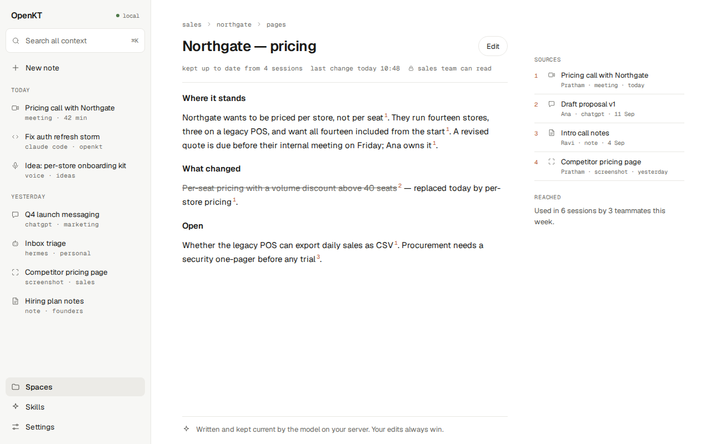

# @openkt/desktop

The OpenKT desktop app: an Electron shell (React, Vite) built screen for screen from the design canvas in [`design/canvas/`](../../design/canvas/). It is a control pane — sessions, spaces, living pages, access, connectors, models, hotkeys — and the future home of local capture.




## Status

- **Works now.** Every screen renders and navigates on seeded mock data (`src/api/mock/`). Unit tests cover the routes and the API adapter's request shapes.
- **Real, on this Mac.** Voice notes (whisper.cpp) and screenshots (Apple Vision OCR + the local vision model) — interim runtime, see [`src/main/models/README.md`](src/main/models/README.md). So far they are compiled and exercised only on the macOS CI runner, not on a physical Mac.
- **Stubbed.** Meeting capture runs against `StubEngine`, which returns canned text. The Swift capture engine does not exist yet; [`src/main/engine/README.md`](src/main/engine/README.md) describes the seam it will plug into.
- **Untested.** The `http` adapter (`src/api/http.ts`) follows [`docs/specs/04-api-contract.md`](../../docs/specs/04-api-contract.md) but has not been run against a live server. Methods the server does not expose yet fall back to mock data.
- **Planned.** Sign-in, wiring AI tools from the app, page editing, macOS packaging and signing. See [`PLAN.md`](../../PLAN.md), version 0.3.

## Run it

From the repository root, after `npm ci`:

```
npm run dev -w @openkt/desktop            # the renderer in a browser, http://localhost:5173, mock data
npm run dev:electron -w @openkt/desktop   # the Electron shell against that dev server (start `dev` first)
npm run start -w @openkt/desktop          # build, then open the Electron app
npm run typecheck -w @openkt/desktop
npm test -w @openkt/desktop
npm run build -w @openkt/desktop
```

The app uses mock data unless told otherwise. To point it at a server, set `VITE_OPENKT_API=http`, `VITE_OPENKT_BASE_URL` and `VITE_OPENKT_TOKEN` before starting.

`npm run shots -w @openkt/desktop` screenshots every route into `shots/` (not tracked) and checks that fonts loaded and nothing overflows. It needs a local Chromium; set `CHROMIUM_PATH`. It never downloads a browser.

## Layout

| Path | What |
|---|---|
| `src/app/` | Entry point and routes |
| `src/screens/` | One file per screen, matching an artboard on the canvas |
| `src/components/` | Shell, sidebar, command palette, access panel, icons |
| `src/api/` | The `OpenKTClient` interface, the mock adapter and the `http` adapter |
| `src/main/` | Electron main process: windows, tray, shortcuts, capture, the engine seam |
| `src/preload/`, `src/shared/` | The IPC bridge and its types |
| `src/styles/` | Design tokens and CSS |

The UI must match the canvas. If a screen is not on the canvas, it is not ready to build — open an issue labelled `question`.

The app bundles the Geist and Geist Mono typefaces (SIL Open Font License 1.1) through the `@fontsource-variable` packages; see [`NOTICE`](../../NOTICE).

Apache-2.0.
