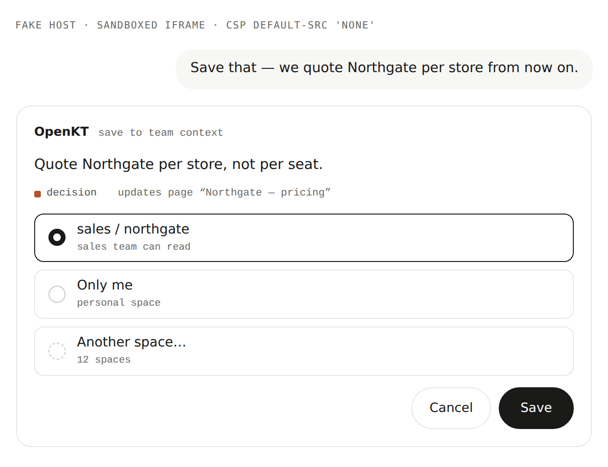
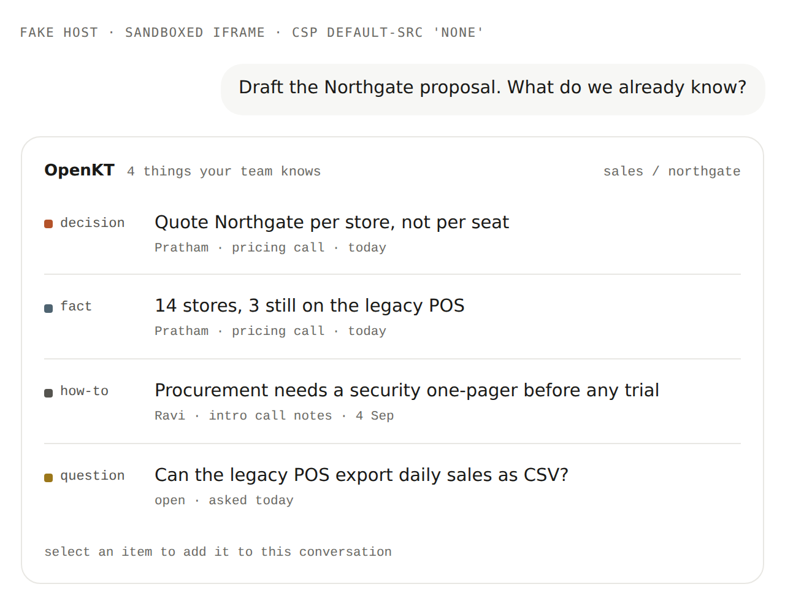

# @openkt/mcp-cards

One self-contained MCP Apps UI bundle for the OpenKT server: a **save** card with a space picker, a **search results** card, and a **session summary** card. It is written for hosts that implement the `io.modelcontextprotocol/ui` extension (claude.ai, Claude Desktop, ChatGPT, Cursor, VS Code and others) so people can see and steer OpenKT inside tools that have no OpenKT interface.

**Status.** The bundle builds, passes its unit tests and renders in the bundled fake host (`preview.html`). It has not yet been exercised inside a real host, and the server does not register it yet ([`server-integration.md`](server-integration.md) says what that takes).

| Save | Search results |
|---|---|
|  |  |

```
npm run build   -w @openkt/mcp-cards   # → dist/openkt-cards.html (+ .meta.json with the hashed ui:// URI)
npm test        -w @openkt/mcp-cards   # build + unit tests
npm run preview -w @openkt/mcp-cards   # fake host at http://127.0.0.1:4180/preview.html
npm run shots   -w @openkt/mcp-cards   # screenshots + end-to-end checks (needs a local Playwright + Chromium)
```

- `src/cards.js` — the view; uses the official `@modelcontextprotocol/ext-apps` `App` class (handshake, auto-resize, tool calls, model-context updates).
- `src/model.js` — pure data shaping, unit-tested.
- `src/cards.css` — the approved design (`design/canvas/MCP-Save.dc.html`, `MCP-Search.dc.html`): neutral greys, 16px card radius, `#1a1a18` primary button, system font stack, light and dark, down to 320px.
- `server-integration.md` — exactly what the server must register and return.
- `preview.html` — a fake host: sandboxed iframe, CSP `default-src 'none'`, fake data.
- `screenshots/` — written by `npm run shots` and not tracked: the three views in light and dark at 380px and 640px, plus the expanded picker, saved, error, pinned, mixed-space and empty states. Two of them are kept in `docs/images/`.

`dist/openkt-cards.html` is committed on purpose: it is the artefact the server serves. `shots` looks for Playwright through `PLAYWRIGHT_MODULE` and Chromium through `CHROME_BIN`; it never downloads a browser.

The committed bundle includes third-party code (`@modelcontextprotocol/ext-apps`, `zod`); see [`NOTICE`](../../NOTICE).

Apache-2.0.
